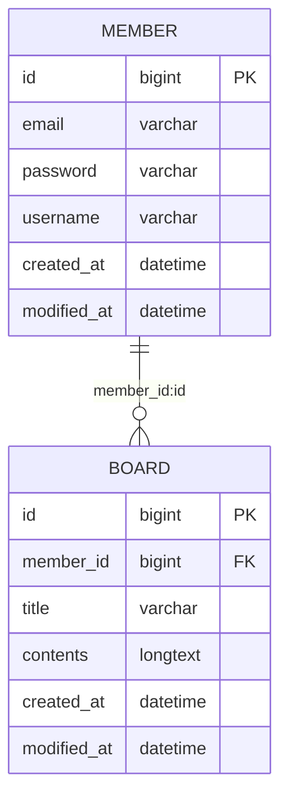

# Schedule Management Application Project: Todo List Development Version
스파르타 내일배움캠프 Spring 4기 과제에 사용한 프로젝트입니다.

<br>

## 📇 목차
1. [소개](#-프로젝트-소개)
2. [설치 방법](#-설치-방법)
3. [사용 방법](#-사용-방법)

<br>

## 🧑‍🏫 프로젝트 소개
- 이 프로젝트는 간단한 일정 관리 애플리케이션입니다.
- 사용자는 회원 가입을 통해 일정 항목을 생성, 조회, 수정 및 삭제할 수 있습니다.

<br>

## 🕰️ 개발 기간

\- **2024. 12. 11. (수) ~ 2024. 12. 19. (목)**

\- 공부 기간: 2024. 12. 11. (수) ~ 2024. 12. 16. (월)

\- 개발 기간: 2024. 12. 16. (월) ~ 2024. 12. 19. (목)

<br>

## 🐣 개발자 소개

- 강유진


[Git 링크](https://github.com/YJ-Kkang)

[블로그 링크](https://velog.io/@yjkang/posts)


<br>

## 💬 요구 사항 정의
1. **회원 관리 기능**
    - 회원 생성(회원 가입): 사용자가 회원 정보를 등록해 가입할 수 있음.
    - 회원 조회: 등록된 회원을 조회(전체 회원 조회, 특정 회원 조회)할 수 있음.
    - 회원 수정: 회원 정보 중 `username`을 수정할 수 있음.
    - 회원 삭제(회원 탈퇴): 특정 회원을 삭제할 수 있음.


2. **일정 관리 기능**
    - 일정 생성: 사용자가 새로운 일정(게시글 형식, 제목과 내용 포함)을 등록할 수 있음.
    - 일정 조회: 등록된 일정을 조회할 수 있음.
    - 일정 수정: 일정의 세부 정보를 수정할 수 있음.
    - 일정 삭제: 등록된 일정을 삭제할 수 있음.


3. **사용자 인증 방식**: 회원 정보 수정 시 비밀번호 확인, 게시글 생성 시 유저명 확인.


4. **예외 처리**
    - 잘못된 입력 처리: 유효하지 않은 데이터 입력 시 오류 메시지 출력.
    - 비밀번호 불일치 처리: 회원 정보 수정 시 입력한 비밀번호가 일치하지 않을 경우 접근 거부 처리.


5. **기능 목록**
    - 일정 작성, 수정, 조회 시 반환 받은 일정 정보에 `비밀번호`는 제외.
    - 일정 수정, 삭제 시 선택한 일정의 `비밀번호`와 요청할 때 함께 보낸 `비밀번호`가 일치할 경우에만 가능.
    - 비밀번호가 일치하지 않을 경우 적절한 오류 코드 및 메세지를 반환.

<br>

## 📝 설계
1. **클래스 다이어그램**
>- `ScheduleApplication`: 스케줄 프로젝트의 메인 애플리케이션 클래스

>Controller
>- `BoardController`: 일정(게시글) 관련 HTTP 요청을 처리하는 컨트롤러 클래스
>- `MemberController`: 회원 관련 HTTP 요청을 관리하는 컨트롤러 클래스

>DTO
>>RequestDto
>- `CreateBoardRequestDto`: 새로운 일정 생성을 위한 데이터 전송 객체
>- `SignUpMemberRequestDto`: 새로운 회원 가입을 위한 데이터 전송 객체
>- `UpdateBoardRequestDto`: 기존 일정 수정을 위한 데이터 전송 객체
>- `UpdateMemberRequestDto`: 기존 회원 수정을 위한 데이터 전송 객체
>>ResponseDto
>- `BoardResponseDto`: 일정 응답을 위한 데이터 전송 객체
>- `BoardWithIdResponseDto`: 특정 일정(ID 포함) 응답을 위한 데이터 전송 객체
>- `MemberResponseDto`: 회원 응답을 위한 데이터 전송 객체
>- `SignUpMemberResponseDto`: 회원 가입 응답을 위한 데이터 전송 객체

>Entity
>- `BaseEntity`: 모든 엔티티의 기본 클래스
>- `Board`: 일정을 나타내는 엔티티
>- `Member`: 회원을 나타내는 엔티티

>Repository
>- `BoardRepository`: 일정 엔티티의 저장소
>- `MemberRepository`: 회원 엔티티의 저장소

>Service
>- `BoardService`: 일정 관련 비즈니스 로직을 처리하는 서비스 클래스
>- `MemberService`: 회원 관련 비즈니스 로직을 처리하는 서비스 클래스

<br>

2. **기능 분해**: 주요 기능을 메소드로 분리.
- `save()`: 새로운 일정 생성
- `signUp()`: 새로운 회원 생성
- `findAll()`: 전체 일정 조회 / 전체 회원 조회
- `findById()`: 특정 일정 조회 / 특정 회원 조회
- `updateBoard()`: 특정 일정 수정
- `updateMember()`: 특정 회원 정보 수정
- `delete()`: 특정 일정 삭제
- `deleteMember()`: 특정 회원 삭제

<br>

3. **데이터 흐름 설계**: 데이터가 클래스 간에 어떻게 흐를지를 결정.
- 입력: 사용자가 회원 및 일정 데이터를 입력.
- 처리: 입력된 데이터를 기반으로 회원 및 일정 생성, 조회, 수정, 삭제.
- 출력: 회원 및 일정 목록 또는 상세 정보 출력.


<br>

## 🛠 설치 방법
1. Java Development Kit (JDK)를 설치합니다. → [Window](https://teamsparta.notion.site/Window-JDK-f646c4cfdbd34daf81b4315f7abeba1d)    / [Mac](https://teamsparta.notion.site/Mac-JDK-cd42768710404e50a742ce0e187975bf)
2. 이 레포지토리를 클론합니다.
```
bash git clone https://github.com/YJ-Kkang/schedule.git .
```
3. 프로그램을 실행합니다.

<br>

## 🔍 사용 방법
1. [Postman](https://www.postman.com/downloads/)을 사용하여 서버에 요청을 보냅니다.
2. 아래의 `API 명세서`를 참고하여 일정을 생성, 조회, 수정, 삭제합니다.

### 🔗 ERD



<br>

## 📨 문의 사항
Yujin Kang - kyujin995@gmail.com

Project Link: https://github.com/YJ-Kkang/schedule
